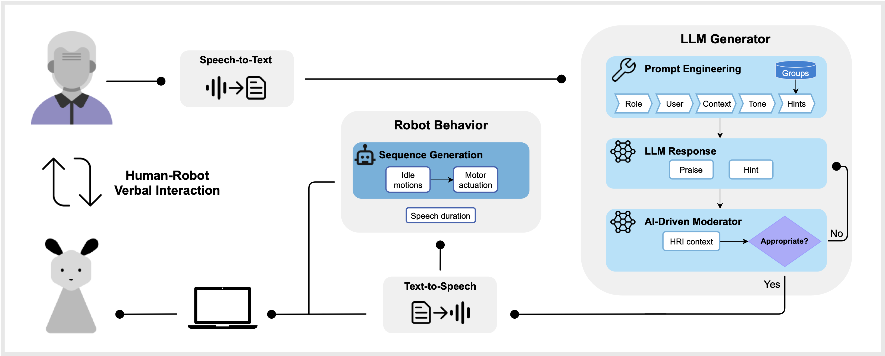
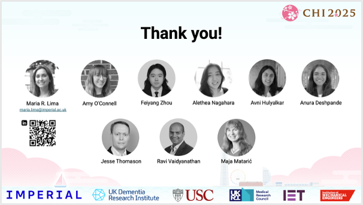

# LLM-Powered Socially Assistive Robots for Cognitive Support

This code is based on the system implementation using for human-robot interaction (HRI) experiments as described in the [paper](https://dl.acm.org/doi/full/10.1145/3706598.3713582) _Promoting Cognitive Health in Elder Care with Large Language Model-Powered Socially Assistive Robots_, presented at [ACM CHI 2025](https://dl.acm.org/doi/proceedings/10.1145/3706598). 

## Abstract
As the global population ages, there is increasing need for accessible technologies that promote cognitive health and detect early signs of cognitive decline.
This study designed an LLM-powered socially assistive robot (SAR) and implemented human-robot verbal dialogue in interactive cognitive tasks based on clinically
validated tools. 
The aim was to evaluate the feasibility of such system to promote cognitive health within residential settings.
We conducted a user study with older adults in retirement homes, involving weekly robot-administered sessions to evaluate cognitive task performance, robot acceptance and verbal engagement. 
This research contributed novel insights into the efficacy of LLM-powered SARs to promote and assess cognitive health in elder care.

## System orchestration
The system consists of STT, LLM-generated responses, robot behavior, and TTS.
We designed a **multi-agent system** that leveraged the linguistic abilities of LLMs for dialogue flexibility and performance in multilingual contexts.
We integrated a _moderator_ for auto-evaluation as a preventive measure to review LLM-generated responses before they were delivered to participants.
The length of the robot’s motion sequences were synchronised with its speech duration to promote natural and engaging interactions.

<div align="center">
  
  <p><em>System implementation of an LLM-powered SAR administering cognitive tasks.</em></p>
</div>


#### Conversational SAR
We used the updated version of the inexpensive Blossom robot, an [open-source](https://github.com/interaction-lab/Blossom-Controller), 3D-printed platform with a gray crocheted exterior, to create a simple and engaging appearance.

#### Robot Behaviour
- We designed a set of idle motions to enhance user engagement with the robot.
- We implemented all idle motions as actuations for each of Blossom’s four motors to manually selected goal positions.
- These include different sequences (of customised duration) of sighing, posture sways, and gaze shifts.
- We synchronized the length of the robot’s motion sequences with its speech duration to promote natural and engaging interactions.

<div align="center">
  
  <p><em>Blossom robot platform.</em></p>
</div>


## Usage
Include your API keys in a `.env` file in the project root directory. 
```
OPENAI_API_KEY=<KEY>
UNREAL_SPEECH_KEY=<KEY>
```
Add your LLM prompts to [`./HRI/LLM.py`](./HRI/LLM.py) to generate contextualised and engaging responses. 


## Citation
If you find this work useful, please consider citing our paper:
```
@inproceedings{lima2025promoting,
  title={Promoting Cognitive Health in Elder Care with Large Language Model-Powered Socially Assistive Robots},
  author={Lima, Maria R and O'Connell, Amy and Zhou, Feiyang and Nagahara, Alethea and Hulyalkar, Avni and Deshpande, Anura and Thomason, Jesse and Vaidyanathan, Ravi and Matari{\'c}, Maja},
  booktitle={Proceedings of the 2025 CHI Conference on Human Factors in Computing Systems},
  pages={1--22},
  year={2025}
}
```

## Acknowledgement
This work was supported by the National Science Foundation grant NSF IIS-1925083, the National Institutes of Health grant NIH 5-P30-AG-073105-02, 
and the UK Dementia Research Institute award number UK DRI-7003 through UK DRI Ltd, principally funded by the Medical Research Council, and additional funding partner Alzheimer’s Society. 

## Contact

For any clarification or interest in the work contact maria.lima@imperial.ac.uk.
<div align="center">
  
  <p><em></em></p>
</div>
